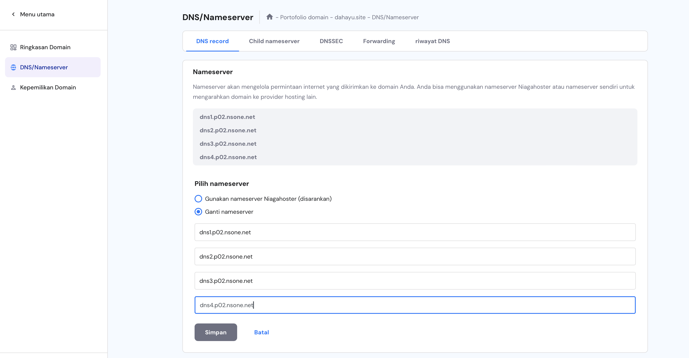
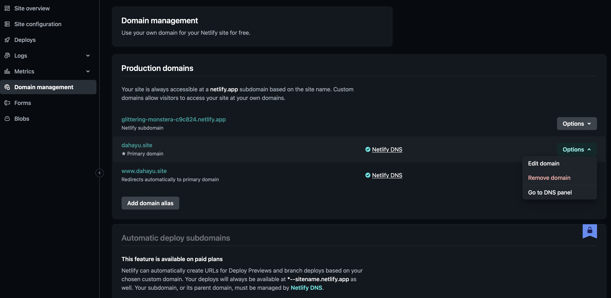
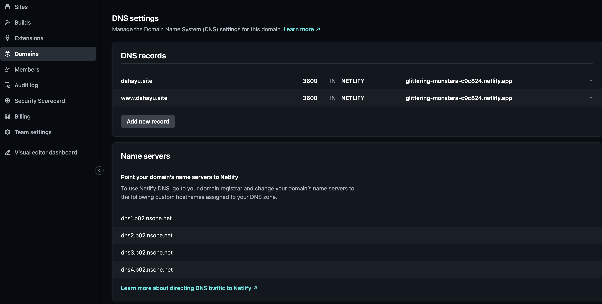

# Dahayu Phinisi Website

Welcome to the **Dahayu Phinisi** website repository. This website showcases a luxury sailing getaway experience to Komodo National Park with an elegant and user-friendly interface.

## Table of Contents

1. [Website Overview](#website-overview)
2. [Features](#features)
3. [Technologies Used](#technologies-used)
4. [Setup Instructions](#setup-instructions)
5. [Screenshots](#screenshots)
6. [Design Choices](#design-choices)
7. [Future Improvements](#future-improvements)
8. [Deployment Guide](#deployment-guide)

---

## Website Overview

The Dahayu Phinisi website is designed to:
- Showcase a one page website that provide an engaging and responsive user experience across devices.
- Provide the information of Dahayu Phinisi as one of the boat operator based in Labuan Bajo.
- Highlight the beauty of Komodo National Park.
- Offer trip options for customers.

---
---
## Features

- **Responsive Design**: Optimized for desktop, tablet, and mobile screens.
- **Dynamic Navigation**: Includes a sticky header and hamburger menu for mobile.
- **Interactive Sections**:
    - Micro interaction with animated colored logo in the header.
    - Hero section with a typewriter effect and call-to-action buttons.
    - Destinations with hover effect to reveal more information.
    - Carousel for Boat Images and Testimonials.
- **Gallery**: Showcases beautiful images from Komodo National Park.
- **Contact Section**: Includes a contact form and links to social media.

---
---

## Technologies Used

- **HTML5**: Structure and semantic layout.
- **CSS**: Custom styling and layout.
- [Tailwind CDN](https://cdn.tailwindcss.com): Utility-first CSS framework for styling.
- **JavaScript**: For interactive elements like the carousel and navigation menu.
- **Google Fonts**: [Aleo](https://fonts.google.com/specimen/Aleo) font for a clean and elegant typography.

---
---

## Setup Instructions

1. **Clone the repository**:
   ```bash
   git clone https://github.com/ef-frat/milestone-1.git

   cd milestone-1

2. **Install Dependencies**: Tailwind CSS is included via a CDN, so no local installation is needed.

3. **Run the Project**:
- Open `index.html` in a Web Browser.
- For a local server, you can use tools like [Live Server](https://marketplace.visualstudio.com/items?itemName=ritwickdey.LiveServer).

4. **Folder Structure**:
- `./assets/style/style.css`: Custom CSS for additional styling
- `./assets/pics/`: Contains all images used in the website.
- `script.js`: Handles JavaScript interactions.

---
---

## Screenshots
Here are some highlights of the website:
- **Hero Section**


- **About Section**


- **Trips Section**


- **Highlight Section (Destinations & Gallery)**


- **Contact Section**


---

## Design Choices
- **Color Palette**:
    - **Aqua** (`#02D8E9`): Represents the pristine water around Komodo National Park.
    - **Dark Gray** (`#434343`) and **Light Gray** (`#777777`): Neutral tones for readability.

- **Typography**:
    - The Aleo font was chosen for its modern and elegant style.

- **User Experience**:
    - Intuitive navigation and concise information provided.
---
---
## Future Improvements
- Add backend functionality for form submissions.
- Add Availability Section for direct booking and online payment.
- Optimize images for faster load times.


---
---

## Deployment Guide 

This guide explains how to deploy the website, set it up on Netlify, and configure a custom domain using Niagahoster.

---

### 1. Deploying to Netlify

#### Step 1: Sign Up and Connect GitHub

1. Go to [Netlify](https://www.netlify.com/) and sign up/log in.
2. Choose **GitHub** and authorize access if necessary.

#### Step 2: Deploy the Website

1. After selecting the repository,
2. Click **Deploy site**. Netlify will provide a temporary URL.

---

### 2. Adding a Custom Domain on Niagahoster

#### Step 1: Purchase the Domain

1. Go to [Niagahoster](https://www.niagahoster.co.id/) and search for "dahayu".
2. Purchase the domain and complete any necessary verifications. In this case I chose ".site".

#### Step 2: Configure DNS on Niagahoster

1. Go to **Domain** > **Manage Domain** for `dahayu.site`.
2. Navigate to the **DNS/Nameserver** section.



#### Step 3: Connect to Netlify

1. In your Netlify dashboard, go to your site settings.
2. Under **Domain Management**, click **Add custom domain** and enter `dahayu.site`.
3. Netlify will prompt you to update your DNS settings on Niagahoster.
4. Once it's done, click **Options** and choose **Go To DNS Panel**.



5. It will shows something like this:



#### Step 4: Set DNS Records on Niagahoster

1. In Niagahoster, add the DNS records from the previous picture. In this example are: "dns1.p02.nsone.net", etc.

2. Copy all that information and paste it to this part at Niagahoster web:


3. Save the changes and wait until it finish.

### Once finished, you will notice the website's URL has changed.

---

## To visit the website, you can [Click Here](https://dahayu.site/).