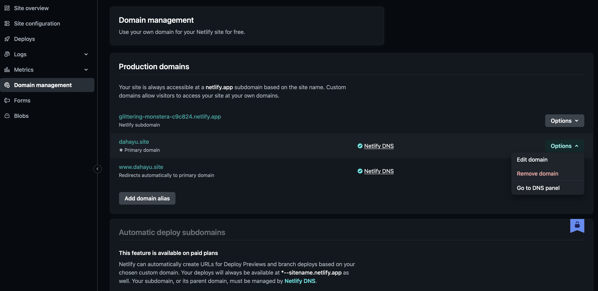
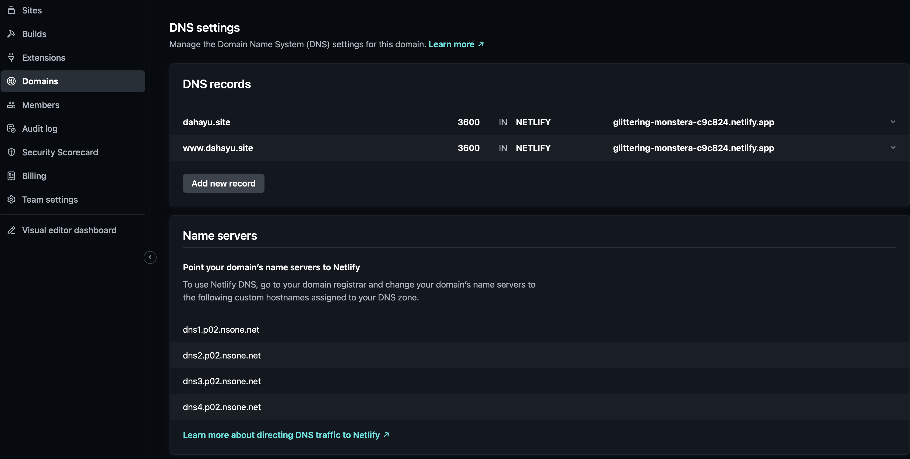

# Deployment Guide for `dahayu.site`

This guide explains how to deploy my website, set it up on Netlify, and configure a custom domain using Niagahoster.

---

## 1. Deploying to Netlify

### Step 1: Sign Up and Connect GitHub

1. Go to [Netlify](https://www.netlify.com/) and sign up/log in.
2. Choose **GitHub** and authorize access if necessary.

### Step 2: Deploy the Website

1. After selecting the repository,
2. Click **Deploy site**. Netlify will provide a temporary URL.

---

## 2. Adding a Custom Domain on Niagahoster

### Step 1: Purchase the Domain

1. Go to [Niagahoster](https://www.niagahoster.co.id/) and search for "dahayu".
2. Purchase the domain and complete any necessary verifications. In this case I chose ".site".

### Step 2: Configure DNS on Niagahoster

1. Go to **Domain** > **Manage Domain** for `dahayu.site`.
2. Navigate to the **DNS/Nameserver** section.

### Step 3: Connect to Netlify

1. In your Netlify dashboard, go to your site settings.
2. Under **Domain Management**, click **Add custom domain** and enter `dahayu.site`.
3. Netlify will prompt you to update your DNS settings on Niagahoster.
4. Once it's done, click **Options** and choose **Go To DNS Panel**.

5. It will shows something like this:

### Step 4: Set DNS Records on Niagahoster

1. In Niagahoster, add the DNS records from the previous picture. In this example are: "dns1.p02.nsone.net", etc.

2. Copy all that information and paste it to this part at Niagahoster web:

3. Save the changes and wait until it finish.

### Once it finish, you will notice the website's URL has changed:

---

## To visit the website, you can [Click Here](https://dahayu.site/).